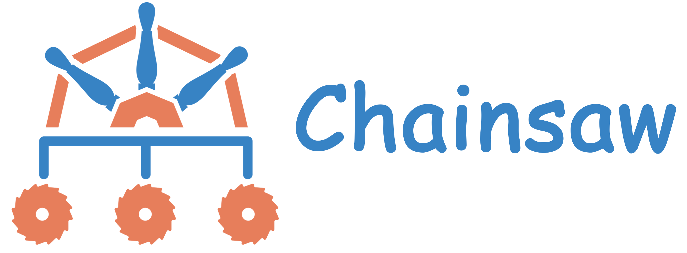

# Chainsaw

## Overview

Chainsaw provides a declarative approach to test [Kubernetes](https://kubernetes.io) operators and controllers.

While Chainsaw is designed for testing operators and controllers, it can declaratively test any Kubernetes objects.

Chainsaw is an open-source tool that was initially developed for defining and running [Kyverno](https://kyverno.io) end-to-end tests.

## Resources

Built under the Kyverno umbrella, you can use the Kyverno Chainsaw **Slack channels** to discuss anything related to Chainsaw.

### Slack channels

- [#kyverno-chainsaw](https://kubernetes.slack.com/archives/C067LUFL43U)

### More resources

- [Kyverno Chainsaw - The ultimate end-to-end testing tool!](https://kyverno.io/blog/2023/12/12/kyverno-chainsaw-the-ultimate-end-to-end-testing-tool/)
- [Kyverno Chainsaw - Exploring the Power of Assertion Trees!](https://kyverno.io/blog/2023/12/13/kyverno-chainsaw-exploring-the-power-of-assertion-trees/)
- [Nirmata Office Hours for Kyverno- Episode 9- Demonstrate Kyverno Chainsaw](https://www.youtube.com/watch?v=IrIteTTjlbU)
- [Kubebuilder Community Meeting - February 1, 2024](https://www.youtube.com/watch?v=Ejof-wtAdQM)
- [Kyverno Chainsaw 0.1.4 - Awesome new features!](https://kyverno.io/blog/2024/02/15/kyverno-chainsaw-0.1.4-awesome-new-features/)
- [Mastering Kubernetes Testing with Kyverno Chainsaw!](https://youtu.be/hQJWGzogIiI)

## Getting Started

Please refer to the [Getting Started](https://kyverno.github.io/chainsaw/latest/quick-start/) documentation.

## RoadMap

For detailed information on our planned features and upcoming updates, please [view our Roadmap](./ROADMAP.md).

## Community Meetings

To attend our community meetings, join the [Chainsaw group](https://groups.google.com/g/kyverno-chainsaw).
You will then be sent a meeting invite and will have access to the agenda and meeting notes.
Any member may suggest topics for discussion.

This is a public, weekly meeting for Kyverno-Chainsaw maintainers to make announcements and provide project updates, and request input and feedback.
This forum allows community members to raise agenda items of any sort, including but not limited to any PRs or issues on which they are working.

Weekly every Thursday at 2:00 PM UTC

- [Chainsaw group](https://groups.google.com/g/kyverno-chainsaw)
- [Zoom Meeting](https://zoom.us/j/99815137900)
- [Agenda and meeting notes](https://docs.google.com/document/d/1csszreCpCyPsls4S_GuM0o_D1W-N7vQqQcyd4lxSkJk)

## Contributions

Please read the [contributing guide](https://github.com/kyverno/kyverno/blob/main/CONTRIBUTING.md) for details around:

1. Code of Conduct
1. Code Culture
1. Details on how to contribute
