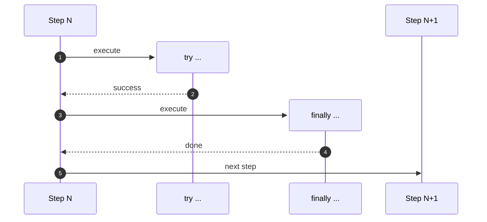
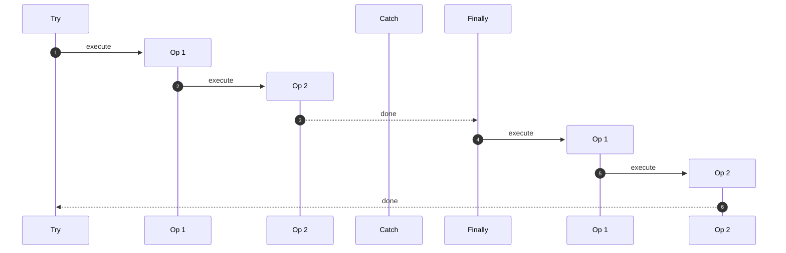
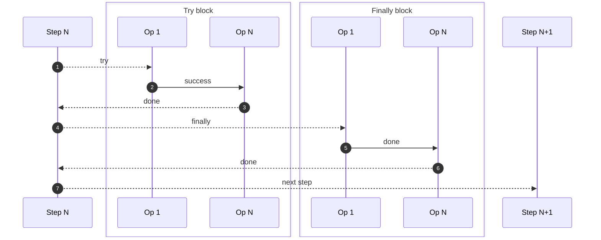
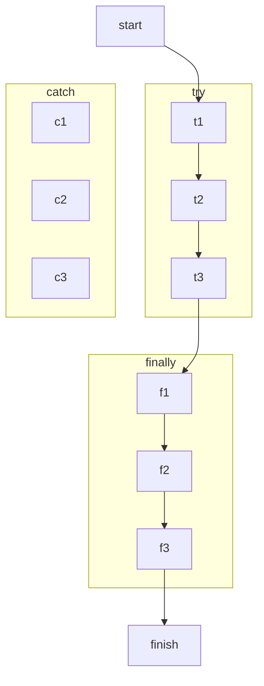
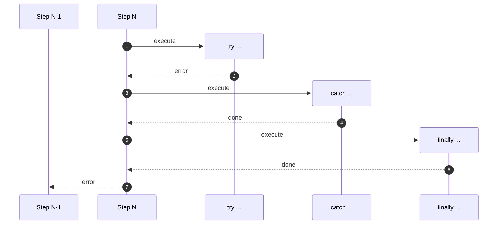

# Step lifecycle

A test step is made of 3 main blocks used to determine the actions Chainsaw will perform, depending on operations outcome:

- The `try` block *(required)*
- The `catch` block *(optional)*
- The `finally` block *(optional)*

Each block can be represented as an ordered sequence of operations.

## Try, Catch, Finally flow

Operations defined in the `try` block are executed first, then:

- If an operation fails to execute, Chainsaw won't execute the remaining operations and will execute **all** operations defined in the `catch` block instead (if any).
- If all operations succeed, Chainsaw will NOT execute operations defined in the `catch` block (if any).
- Regardless of the step outcome (success or failure), Chainsaw will execute **all** operations defined in the `finally` block (if any).

!!! tip

    Note that all operations coming from the `catch` or `finally` blocks are executed. If one operation fails, Chainsaw will mark the test as failed and continue executing with the next operations.

## Sequence

### Without failure

!!! info ""
    1. Test starts by executing Step 1
    1. Step 1 terminates -> Step 2 starts executing
    1. Step 2 terminates -> Step 3 starts executing
    1. Step 3 terminates -> Cleanup for Step 3 starts
    1. Cleanup for Step 3 terminates -> Cleanup for Step 2 starts
    1. Cleanup for Step 2 terminates -> Cleanup for Step 1 is executed

### With failure

