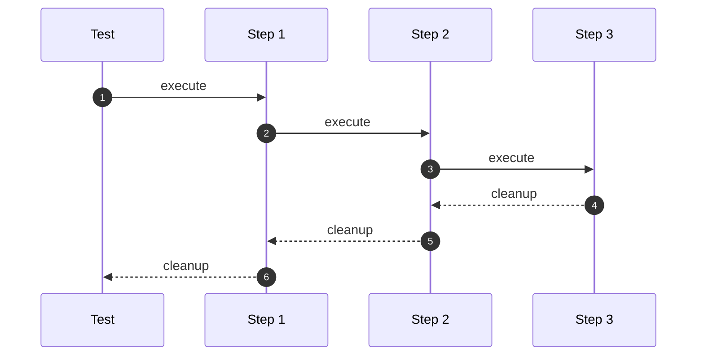
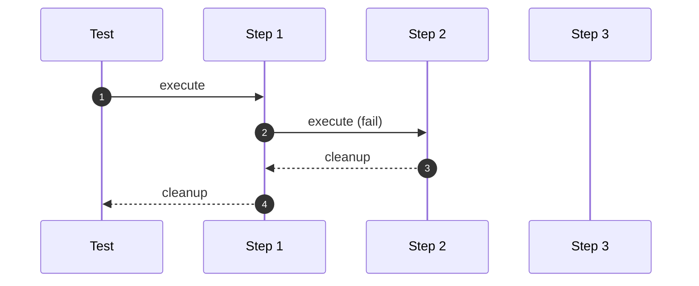

# Test lifecycle

At a high level, a test can be represented as an ordered sequence of test steps.
Each step executes sequentially, one after the other.

At the end of the test, Chainsaw cleans up resources it created during the test, in the opposite order of creation.

## Cleanup

By default, when a step fails, Chainsaw stops the execution and the remaining steps are not executed. The cleanup process starts at the moment the test stops executing.

Note that when a failure happens during cleanup, the test is marked as failed and Chainsaw continues executing cleanup for the remaining steps.

## Sequence

### Without failure

!!! info "Legend"
    1. Test starts by executing Step 1
    1. Step 1 terminates -> Step 2 starts executing
    1. Step 2 terminates -> Step 3 starts executing
    1. Step 3 terminates -> Cleanup for Step 3 starts
    1. Cleanup for Step 3 terminates -> Cleanup for Step 2 starts
    1. Cleanup for Step 2 terminates -> Cleanup for Step 1 is executed

### With failure

!!! info "Legend"
    1. Test starts by executing Step 1
    1. Step 1 terminates -> Step 2 starts executing
    1. Step 2 fails -> Cleanup for Step 2 starts
    1. Cleanup for Step 2 terminates -> Cleanup for Step 1 is executed
