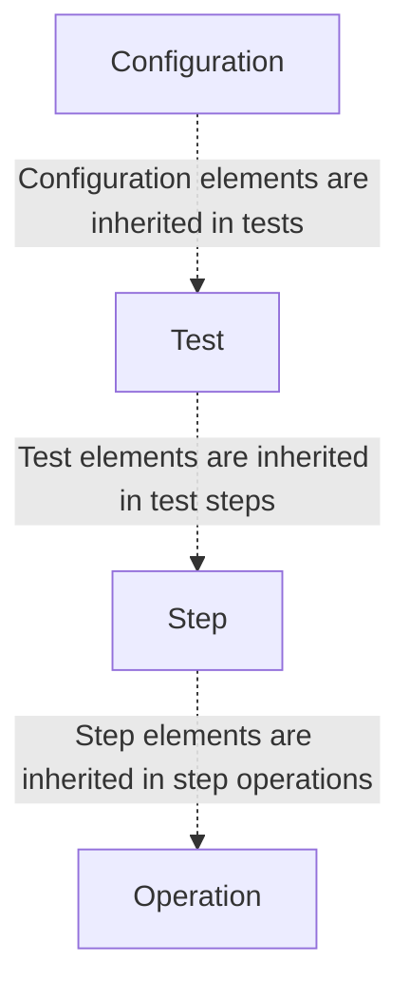

# Inheritance

Chainsaw has a concept of levels and most of the configuration elements and dynamic elements are inherited from one layer to the next in one way or another.

## Levels

### Configuration

The first layer comes from the [Chainsaw configuration](../configuration/index.md). You can think about this layer as the global scope and a way to configure how Chainsaw will behave globally.

Under certain circumstances, lower layers will be allowed to consume and/or override elements from upper layers.

### Test

At the test level, you can override or create new elements. They will only be visible to the test, steps and operations that are part of it.

In any case, tests are strongly isolated and have no way to communicate with or depend on other tests.

### Step

Again, at the step level, you can override or create new elements and they will only be visible to the step and operations that are part of it.

### Operation

At the operation level, you can override or create new elements and use them in the operation itself.

## Immutability

Even if elements are inherited, they are immutable.

Some elements can be overridden but **never overwritten**.

## Outputs

Inheritance always flows from one level to the next and never propagates back to the upper levels.

There's no exception to this rule, but the only case where one operation can communicate with other ones is when using [outputs](./outputs.md).
