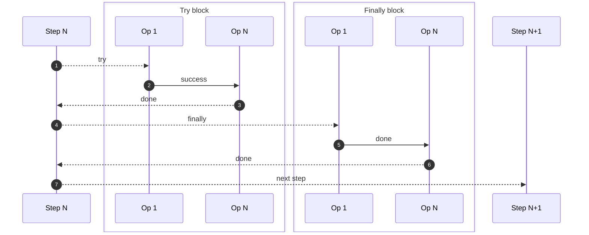
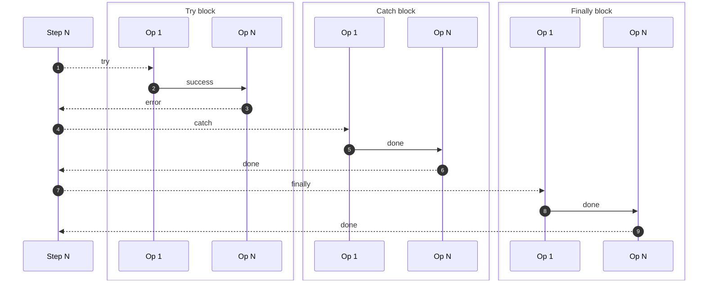

# What is a test step?

A test step is made of four main components used to determine the actions Chainsaw will perform when executing the step.

1. The [try](./try.md) statement *(required)*
1. The [catch](./catch.md) statement *(optional)*
1. The [finally](./finally.md) statement *(optional)*
1. The [cleanup](./cleanup.md) statement *(optional)*

## Syntax

```yaml
apiVersion: chainsaw.kyverno.io/v1alpha1
kind: Test
metadata:
  name: example
spec:
  steps:
    # `try` defines operations to execute in the step
  - try: [...]
    # `catch` defines operations to execute when the step fails
    catch: [...]
    # `finally` defines operations to execute at the end of the step
    finally: [...]
    # `cleanup` defines operations to execute at the end of the test
    cleanup: [...]
```

## Reference

The full structure of `TestStepSpec` is documented [here](../reference/apis/chainsaw.v1alpha1.md#chainsaw-kyverno-io-v1alpha1-TestStepSpec).

## Lifecycle

### Try, Catch, Finally flow

Operations defined in the `try` block are executed first, then:

- If an operation fails to execute, Chainsaw won't execute the remaining operations and will execute **all** operations defined in the `catch` block instead (if any).
- If all operations succeed, Chainsaw will NOT execute operations defined in the `catch` block (if any).
- Regardless of the step outcome (success or failure), Chainsaw will execute **all** operations defined in the `finally` block (if any).

!!! tip

    Note that all operations coming from the `catch` or `finally` blocks are executed. If one operation fails, Chainsaw will mark the test as failed and continue executing with the next operations.

#### Without failure

<div style="text-align: center;">



</div>

!!! info ""
    1. Step starts by executing operations in the `try` block
    1. Operations in the `try` block execute sequentially
    1. All operations in the `try` block terminate
    1. Step starts executing operations in the `finally` block
    1. Operations in the `finally` block execute sequentially
    1. All operations in the `finally` block terminate
    1. Next step starts executing

#### With failure

<div style="text-align: center;">



</div>

!!! info ""
    1. Step starts by executing operations in the `try` block
    1. Operations in the `try` block execute sequentially until an error happens
    1. Operations in the `try` block stop when an error occurs
    1. Step starts executing operations in the `catch` block
    1. Operations in the `catch` block execute sequentially
    1. All operations in the `catch` block terminate
    1. Step starts executing operations in the `finally` block
    1. Operations in the `finally` block execute sequentially
    1. All operations in the `finally` block terminate

### Cleanup

In addition to `try`, `catch` and `finally` blocks, the `cleanup` block of steps is better illustrated in the [Test lifecycle](../test/spec/index.md#lifecycle) diagrams.
