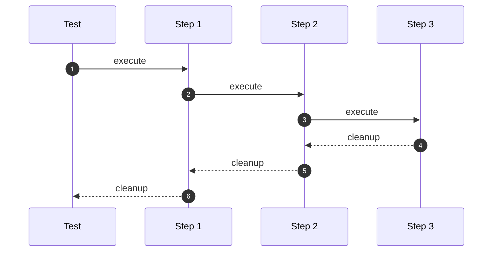
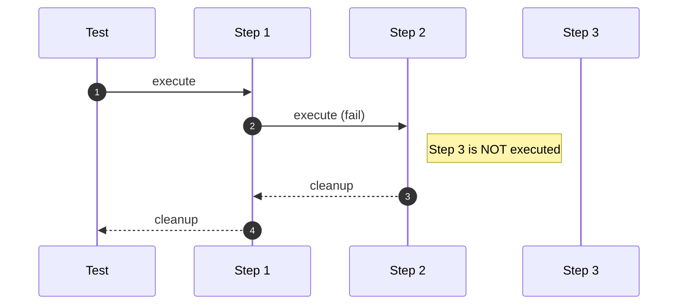

# Test spec

A Chainsaw test is mostly made of steps.

That being said, there are a couple of other interesting fields too.

## Syntax

```yaml
apiVersion: chainsaw.kyverno.io/v1alpha1
kind: Test
metadata:
  name: example
spec:
  # test configuration
  concurrent: false
  bindings:
  - name: foo
    value: bar
  timeouts:
    apply: 1s
    assert: 2m
    delete: 30s
  ...
  steps:
  # step 1
  - try: ...
  # step 2
  - try: ...
    catch: ...
  # step 3
  - try: ...
    catch: ...
    finally: ...
```

### Reference

The full structure of `TestSpec` is documented [here](../../reference/apis/chainsaw.v1alpha1.md#chainsaw-kyverno-io-v1alpha1-TestSpec).

## Lifecycle

### Cleanup

At the end of the test, Chainsaw cleans up resources it created during the test, in the opposite order of creation.

By default, when a step fails, Chainsaw stops the execution and the remaining steps are not executed. The cleanup process starts at the moment the test stops executing.

!!! tip
    Note that when a failure happens during cleanup, the test is marked as failed and Chainsaw continues executing cleanup for the remaining steps.

### Without failure

<div style="text-align: center;">



</div>

!!! info ""
    1. Test starts by executing Step 1
    1. Step 1 terminates -> Step 2 starts executing
    1. Step 2 terminates -> Step 3 starts executing
    1. Step 3 terminates -> Cleanup for Step 3 starts
    1. Cleanup for Step 3 terminates -> Cleanup for Step 2 starts
    1. Cleanup for Step 2 terminates -> Cleanup for Step 1 is executed

### With failure

<div style="text-align: center;">



</div>

!!! info ""
    1. Test starts by executing Step 1
    1. Step 1 terminates -> Step 2 starts executing
    1. Step 2 fails -> Cleanup for Step 2 starts
    1. Cleanup for Step 2 terminates -> Cleanup for Step 1 is executed

## Supported elements

### Namespace

The namespace the test should run into, see [Namespace selection](../../general/namespace.md#selection).

### Namespace template

Eventually provide a template if you something specific, see [Namespace template](../../general/namespace.md#template).

### Timeouts

All timeouts can be specified per test, see [Control your timeouts](../../quick-start/timeouts.md).

### Clusters

Additional clusters can be registered at the test level, see [Multi-cluster options](../../configuration/options/clusters.md).

### Cluster

The cluster (by name) used to run the test, see [Multi-cluster setup](../../examples/multi-cluster.md).

### Bindings

Bindings can be registered at the test level and [inherited](../../general/inheritance.md) in all steps, see [Bindings](../../general/bindings.md).

### Catch

[Catch](../../step/catch.md) blocks can be specified at the test level to declare common catch statements.

### Template

Chainsaw allows [templating](../../general/templating.md) configuration on a per test basis.

### Concurrency

Controlling concurrency per test is also possible, see [Concurrency control](../../examples/concurrency.md).

### Skip

In case you need to skip a test for whatever reason, use `skip: true`.

### Steps

Steps are what tests will execute when they are run, see [Test step spec](../../step/index.md) dedicated section.
